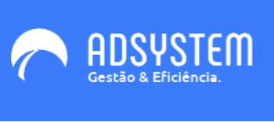

# ADSystem - Gestão eficiente e prática

<!---Esses são exemplos. Veja https://shields.io para outras pessoas ou para personalizar este conjunto de escudos. Você pode querer incluir dependências, status do projeto e informações de licença aqui--->

Projeto desenvolvido como Trabalho de Conclusão de Curso no IFRJ - CNIT. Visa a criação de um SaaS de gestão de estoque, compras e usuários com uso das tecnologias
mais atuais do mercado (NodeJS e ReactJS).

### Ajustes e melhorias

O projeto ainda está em desenvolvimento e as próximas atualizações serão voltadas nas seguintes tarefas:

- [x] Inclusão da interface em ReactJS
- [x] Integração com API via Axios.js
- [x] Deploy da versão de apresentação do sistema
- [ ] Refatoração de código do Back-end para melhor lógica de funcionamento
- [ ] Nova interface e telas

## 📝 Licença

Esse projeto está sob licença. Veja o arquivo [LICENÇA](LICENSE.md) para mais detalhes.

[⬆ Voltar ao topo](#nome-do-projeto) 
